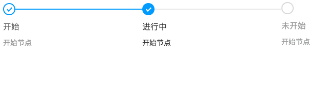

# steps-react

一个简单的 react setps 组件。效果如下：



## 安装

```
npm i steps-react
```

## 使用方式

```
import Steps from 'steps-react';
```

```js
<Steps
  current={1}
  source={[
    { id: "1", title: "开始", description: "开始节点" },
    { id: "2", title: "进行中", description: "开始节点" },
    { id: "3", title: "未开始", description: "开始节点" },
  ]}
/>
```

## code

[github 代码地址](https://github.com/codepandy/steps-react)

### 运行 demo

clone 下代码后，安装依赖，运行即可查看

```
npm install

npm run start
```
